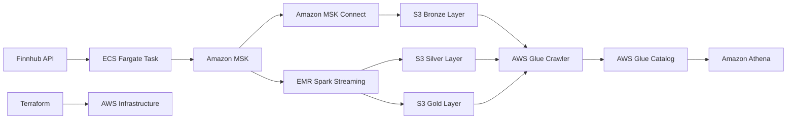

# Real-time BTC/USD Data Pipeline with Medallion Architecture and ECS Fargate

## Description
This project implements a real-time data pipeline that continuously retrieves BTC/USD cryptocurrency data from the Finnhub API using AWS Fargate, streams it through Amazon MSK (Managed Streaming for Apache Kafka), and processes it using a medallion architecture. The raw data is stored in the S3 Bronze layer via Amazon MSK Connect. Real-time processing is performed using Spark Streaming on EMR, with results stored in Silver and Gold layers in S3. AWS Glue Crawler discovers and catalogs the data, making it available for SQL-based querying through Amazon Athena.

## Tech Stack
- AWS Fargate (ECS) for continuous data fetching
- Amazon Managed Streaming for Apache Kafka (MSK)
- Amazon MSK Connect with S3 Sink Connector
- Amazon S3 (Bronze, Silver, and Gold layers)
- Apache Spark Streaming on Amazon EMR
- AWS Glue Crawler and Catalog
- Amazon Athena
- Terraform (for infrastructure management)
- Docker
- GitHub Actions (for CI/CD)

## Prerequisites
To run this project, you need:
- An AWS account (Free Tier account recommended for initial setup and testing)
- Terraform installed on your local machine (version 0.14.0 or later)
- Docker installed on your local machine
- A Finnhub API key (free tier)
- Basic understanding of AWS services, Apache Kafka, and Spark
- AWS CLI configured with your credentials
- Git for version control

## AWS Free Tier Usage
This project is designed to work within the AWS Free Tier limits as much as possible. Here's what you need to know:

1. ECS Fargate: We use the smallest available configuration (0.25 vCPU, 0.5 GB memory) to stay within Free Tier limits.
2. ECR: The Free Tier includes 500MB-month of storage for 12 months.
3. MSK: Unfortunately, Amazon MSK is not included in the Free Tier. We've configured it with the minimum settings, but it will incur charges.
4. EMR: Also not included in Free Tier. We've used the smallest recommended instance types, but it will incur charges.
5. S3 and DynamoDB: Used for Terraform state management, both have Free Tier allowances.

**Note**: While we've optimized for Free Tier usage where possible, running this entire infrastructure will incur some charges, primarily due to MSK and EMR. Monitor your AWS billing dashboard closely.

## Requirements

### Python Dependencies
Create a `requirements.txt` file in your project root with the following contents:

```
finnhub-python==2.4.20
kafka-python-ng==2.2.2
```

To install these dependencies, run:

```bash
pip install -r requirements.txt
```

### Other Tools
- Docker: Required for containerizing the application. [Install Docker](https://docs.docker.com/get-docker/)
- AWS CLI: Needed for interacting with AWS services. [Install AWS CLI](https://aws.amazon.com/cli/)
- Terraform: Used for infrastructure as code. [Install Terraform](https://learn.hashicorp.com/tutorials/terraform/install-cli)

### Environment Variables
The following environment variables need to be set:

- `FINNHUB_API_KEY`: Your Finnhub API key
- `MSK_BOOTSTRAP_SERVERS`: Comma-separated list of MSK bootstrap servers
- `KAFKA_TOPIC`: The Kafka topic to publish to
- `MSK_USERNAME`: Username for MSK authentication
- `MSK_PASSWORD`: Password for MSK authentication

These can be set in your local environment for development, and are included in the Terraform configuration for the Fargate task.

## Design


Explanation of the diagram:
1. AWS Fargate runs a containerized Python script that continuously fetches data from the Finnhub API.
2. The script produces the data to an Amazon MSK topic.
3. Amazon MSK Connect with S3 Sink Connector consumes data from MSK and writes it to the S3 Bronze layer in Parquet format.
4. Spark Streaming job on EMR consumes data from MSK, processes it, and writes to Silver and Gold layers in S3.
5. AWS Glue Crawler regularly scans the S3 buckets to discover new data and update the AWS Glue Catalog.
6. Amazon Athena uses the AWS Glue Catalog to enable SQL-based querying of the data stored in all layers.
7. Terraform manages the entire AWS infrastructure.

## Developer Guide

### Project Setup
1. Clone the repository and navigate to the project directory:
   ```bash
   git clone https://github.com/rudydesplan/btc-usd-pipeline.git
   cd btc-usd-pipeline
   ```

2. Install the required Python dependencies:
   ```bash
   pip install -r requirements.txt
   ```

### AWS Resource Configuration
- ECS Fargate tasks use 0.25 vCPU and 0.5 GB memory.
- MSK cluster uses 2 broker nodes with kafka.t3.small instances and 1 GiB storage each.
- EMR cluster uses m4.large instances for both master and core nodes.

To further reduce costs, consider:
1. Stopping the EMR cluster when not in use.
2. Reducing the number of MSK broker nodes to 1 for development (not recommended for production).
3. Using AWS Free Tier eligible services for development and testing when possible.

### Terraform State Management
This project uses remote state management with S3 and DynamoDB for enhanced security and collaboration:

1. State files are stored in an S3 bucket with versioning and encryption enabled.
2. State locking is implemented using a DynamoDB table to prevent concurrent modifications.
3. Terraform workspaces are used to manage different environments (development, production).

To initialize Terraform with the remote backend:

```bash
cd terraform
terraform init
```

To create or switch to a workspace:

```bash
terraform workspace new development
# or
terraform workspace select development
```

Always ensure you're in the correct workspace before applying changes:

```bash
terraform workspace show
```

### Deploying the Infrastructure
1. Update the `main.tf` file with your specific AWS resource identifiers (subnet IDs, security group IDs, etc.).
2. Create a `terraform.tfvars` file with your Finnhub API key and other sensitive variables:
   ```hcl
   finnhub_api_key = "your-api-key-here"
   msk_username = "your-msk-username"
   msk_password = "your-msk-password"
   ```
3. Run `terraform plan` to see the planned changes.
4. Run `terraform apply` to create the AWS resources.

### Building and Pushing the Docker Image
1. Build the Docker image:
   ```bash
   docker build -t btc-usd-fetcher .
   ```
2. Tag and push the image to ECR:
   ```bash
   aws ecr get-login-password --region your-region | docker login --username AWS --password-stdin your-account-id.dkr.ecr.your-region.amazonaws.com
   docker tag btc-usd-fetcher:latest your-account-id.dkr.ecr.your-region.amazonaws.com/btc-usd-fetcher:latest
   docker push your-account-id.dkr.ecr.your-region.amazonaws.com/btc-usd-fetcher:latest
   ```

### Developing and Updating the Spark Streaming Job
1. The Spark job code is located in the `spark/` directory.
2. Update the job as needed to process the incoming data and write to Silver and Gold layers.
3. Submit the updated job to the EMR cluster:
   ```bash
   aws emr add-steps --cluster-id j-XXXXXXXXXXXXX --steps Type=Spark,Name="BTC-USD Streaming",ActionOnFailure=CONTINUE,Args=[--deploy-mode,cluster,--master,yarn,--conf,spark.yarn.submit.waitAppCompletion=true,s3://your-bucket/path-to-script/btc_usd_streaming.py]
   ```

## CI/CD Pipeline
This project uses GitHub Actions for continuous integration and deployment. The workflow does the following:

1. Builds the Docker image for the BTC/USD fetcher.
2. Pushes the image to Amazon ECR.
3. Updates the ECS service to use the new image.
4. Runs Terraform to apply any infrastructure changes.

The workflow is triggered on pushes to the main branch and on pull requests to the main branch.

To set up the CI/CD pipeline:

1. In your GitHub repository, go to Settings > Secrets.
2. Add the following secrets:
   - AWS_ACCESS_KEY_ID
   - AWS_SECRET_ACCESS_KEY
   - FINNHUB_API_KEY
   - MSK_USERNAME
   - MSK_PASSWORD

Ensure that the AWS credentials have the necessary permissions to push to ECR, update ECS services, and apply Terraform changes.

## Key Points to Remember
- The Fargate task runs continuously, fetching data every second to respect the Finnhub API rate limit.
- Monitor the Fargate task's logs and performance to ensure it's running smoothly.
- Regularly review and optimize your Spark Streaming job for performance and cost-efficiency.
- Ensure proper error handling and logging in the Python script.
- Keep your Docker image updated when you make changes to the Python script.
- Secure your API keys and other sensitive information. Never commit them to version control.
- Regularly update your dependencies to ensure you have the latest security patches.
- Always use the remote backend for Terraform state to ensure consistency across the team.
- Be cautious when making changes to the Terraform state bucket or DynamoDB table, as these are critical for managing your infrastructure.
- Regularly review and rotate the AWS access keys used for CI/CD to maintain security.
- Regularly monitor your AWS usage and billing to avoid unexpected charges.
- Consider setting up AWS Budgets to alert you when you're approaching Free Tier limits or specific cost thresholds.

## Troubleshooting
If you encounter any issues:
- Check CloudWatch Logs for any error messages related to the Fargate task or MSK Connect.
- Verify that the Fargate task has the necessary permissions to access the Finnhub API and write to MSK.
- Check EMR logs for any Spark Streaming job errors.
- Ensure that the EMR cluster has the necessary permissions to read from MSK and write to S3.
- If the data isn't appearing in S3, check the MSK Connect configuration and logs.
- For Athena query issues, verify that the Glue Catalog is correctly set up and that the data formats match your expectations.
- If you encounter state locking issues, check the DynamoDB table for any stuck locks. You may need to manually release a lock if a process was interrupted.
- If you encounter "insufficient capacity" errors, it may be due to Free Tier restrictions in certain regions. Try deploying in a different region or contact AWS support.

Common issues and solutions:
1. Fargate task stops unexpectedly:
   - Check if you've exceeded the Finnhub API rate limit.
   - Verify that the MSK cluster is accessible from the Fargate task's VPC.

2. Data not appearing in S3:
   - Confirm that MSK Connect is correctly configured and running.
   - Check the MSK topic to ensure data is being produced correctly.

3. Spark job failing:
   - Verify that the input data format matches what the Spark job expects.
   - Check for any changes in the MSK topic name or S3 bucket structure.

4. Athena queries returning no results:
   - Ensure the Glue Crawler has run recently to pick up new data.
   - Check that the table names and column names in your queries match the Glue Catalog.

## Author
DESPLAN RUDY
Email: [desrudy@hotmail.com]
GitHub: [https://github.com/rudydesplan]

## License
This project is licensed under the MIT License - see the [LICENSE.md](LICENSE.md) file for details.

## Acknowledgments
- Finnhub for providing the cryptocurrency data API
- The AWS team for their comprehensive documentation
- The Apache Kafka and Spark communities for their excellent streaming data processing tools